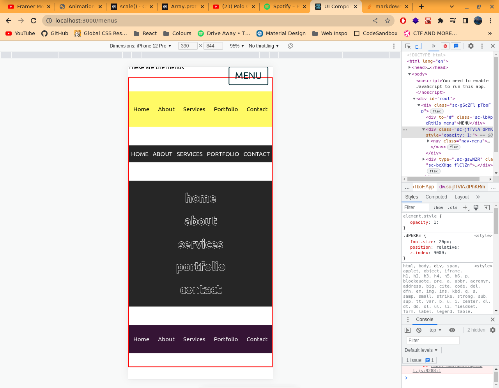

## Animating various UI components using styled compoennts

### things i'm facing

- on the individual pages,everything is fully responsive, on the page to display all the elements, every component is doing its own thing

